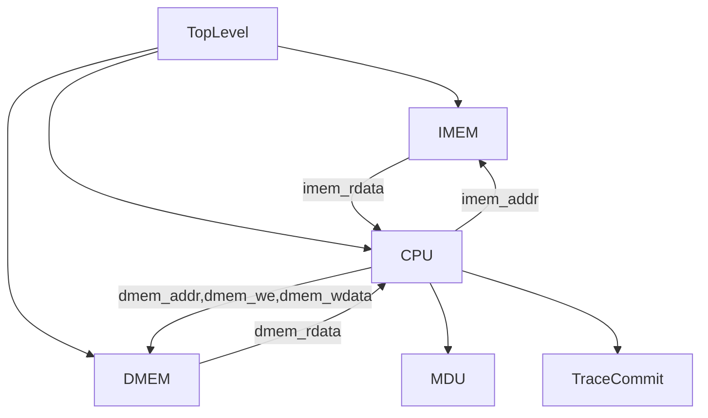

# 50条指令流水线CPU设计

## 目标

设计并实现五级流水线MIPS CPU，支持以下MIPS指令：

- ALU指令：ADD / ADDU / SUB / SUBU / SLL / SRL / SRA / SLLV / SRLV / SRAV / AND / OR / XOR / NOR / SLT / SLTU  
- 加载立即数到高位：LUT  
- 带有立即数的ALU指令：ADDI / ADDIU / ANDI / ORI / XORI / SLTI / SLTIU  
- 乘除法器指令：MULT / MULTU / DIV / DIVU / MFHI / MTHI / MFLO / MTLO  
- 分支指令：BEQ / BNE / BLEZ / BGTZ / BGEZ / BLTZ  
- 无条件跳转指令：JR / JALR / J / JAL  
- 访存指令：LB / LBU / LH / LHU / LW / SB / SH / SW  
- 附加syscall：根据MARS手册实现正确的停止syscall (10号功能)以及整数输出syscall (1号功能)

## 说明

### 乘除法

乘除法的计算较慢，我们假设乘除法需要多个周期完成。

MIPS中乘除法的运算独立于ALU，由乘除法器（MDU）完成。乘除法器位于EX级，MULT/DIV等乘除法运算指令不会等待计算结果，而是由乘除法器在内部继续进行运算，并输出一个信号表示其正忙（busy）。待busy状态结束后将能够通过MFHI/MFLO指令读取其内部寄存器HI/LO的值。

处于busy状态的乘除法器无法接受任何操作，此时任何需要用到乘除法器的指令都应当阻塞在EX级。

我们给出了 `MultiplicationDivisionUnit.sv` 作为乘除法器的实现。其用法为：

- 传入全局的reset与clock信号  
- 传入两个输入operand1与operand2，分别为左右操作数  
  - 当进行写入HI/LO操作（即MTHI/MTLO）时，被写入的值为operand1  
- 传入枚举值operation，为要进行的操作  
  - MDU_READ_HI  
  - MDU_READ_LO  
  - MDU_WRITE_HI  
  - MDU_WRITE_LO  
  - MDU_START_SIGNED_MUL  
  - MDU_START_UNSIGNED_MUL  
  - MDU_START_SIGNED_DIV  
  - MDU_START_UNSIGNED_DIV  
- 传入开始运算信号start  
  - 请在有乘除法指令进入EX阶段，并且busy信号为0时设置该信号  
  - 设置该信号时operation需要传入MDU_START_开头的枚举值  
- 输出忙信号busy  
  - 该信号被设置时，任何使用乘除法器的指令需要阻塞在EX级  
- 输出读取的值dataRead  
  - 当operation传入MDU_READ_开头的枚举值时有效  

为了和Mars的行为一致，该乘除法器实现在除数为0时会保留HI/LO的旧值，你不需要考虑这个行为。

---

### 非对齐内存访问

- **非对齐读**：请在 MEM 级完成对非对齐读的处理，以便将 MEM/WB 中的结果通过旁路转发出去，而不是在 WB 级进行处理。  
- **非对齐写**：为了和 Mars 的行为一致，在输入写内存操作时，请将该操作视为对所在的字进行了一次写入。  

如，位于 @x00003004 的指令对地址 @x00001231 写入了 @x11，且 @x00001230 处原本的内容为 @xaabbccdd，  
你应当输出：  

`QQ×00003004: +@x00001230 ≤ @xaabb11dd`

---

## 测试

我们将在服务器的统一环境上进行自动化测试，将提供 Vivado 2019.1 和 VCS 两种仿真工具。具体测试程序包括但不限于：  
[https://github.com/ceerRep/mips-asm-test](https://github.com/ceerRep/mips-asm-test)

除调试目的外，你不应对 `mips_tb.v` 和 `MultiplicationDivisionUnit.sv` 做任何修改，最终测试时将使用这两个文件的下发版本。

---

## 提交

请提交所有自己编写的代码文件与实验报告。

会使用 [https://github.com/ceerRep/mips-asm-test](https://github.com/ceerRep/mips-asm-test) 进行测试。

最后两个实验上机时会有单独的检查测试，具体时间待定。