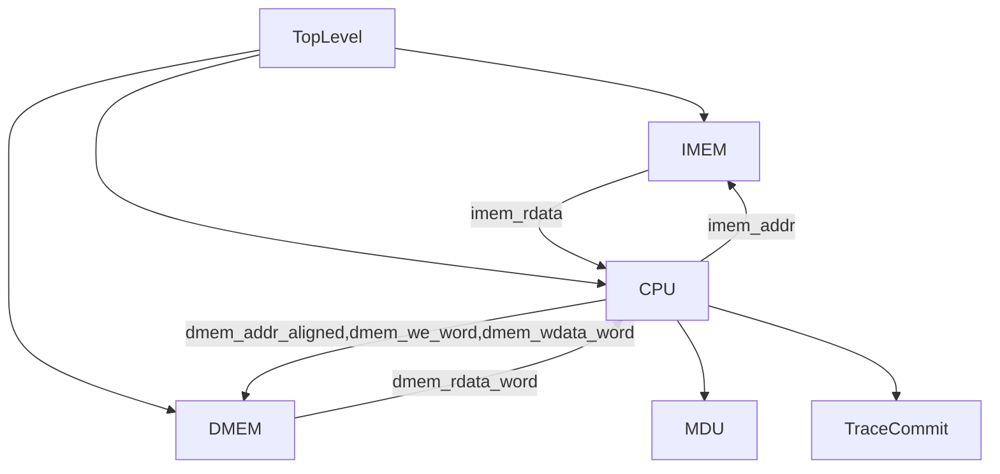

# 50条指令五级流水线 CPU（Inst50）实验报告

    王艺杭 
    2023202316

## 实验目的与要求

本实验目标是设计并实现一个**五级流水线（IF/ID/EX/MEM/WB）MIPS CPU**，并满足如下要求（实验指导）：

- **支持 50 条指令子集**：
  - **ALU**：ADD/ADDU/SUB/SUBU/AND/OR/XOR/NOR/SLT/SLTU/SLL/SRL/SRA/SLLV/SRLV/SRAV
  - **立即数**：LUI、ADDI/ADDIU/ANDI/ORI/XORI/SLTI/SLTIU
  - **分支/跳转**：BEQ/BNE/BLEZ/BGTZ/BGEZ/BLTZ、J/JAL/JR/JALR
  - **访存**：LB/LBU/LH/LHU/LW、SB/SH/SW
  - **乘除法器**：MULT/MULTU/DIV/DIVU/MFHI/MFLO/MTHI/MTLO
  - **syscall**：实现 MARS 语义的 **syscall 1（输出整数）** 与 **syscall 10（退出）**
- **乘除法器（MDU）多周期**：MDU 位于 EX 级，busy 时**所有需要 MDU 的指令必须阻塞在 EX**。
- **非对齐访存处理**：
  - 非对齐读：在 **MEM 级**完成对齐抽取与符号/零扩展，便于旁路。
  - 非对齐写：按“对齐到所在 word 的一次写入”处理，并按该 word 的地址输出日志。
- **日志输出**：与 MARS 一致的提交顺序与格式：
  - 寄存器写回：`@%08h: $%2d <= %08h`
  - 内存写入：`@%08h: *%08h <= %08h`

## 实验环境与工具

- **操作系统**：Windows 11
- **仿真工具**：Vivado（xsim）2025.2
- **参考工具**：MARS（`thirdparty/pipline-tester-py/Mars.jar`）
- **自动对拍脚本**：`thirdparty/pipline-tester-py`（Vivado 模式与 MARS 对拍）

## 总体架构与顶层接口

测试平台 `mips_tb.v` 只会实例化 `TopLevel(reset, clock)`，因此顶层必须自洽地包含 IMEM/DMEM/CPU/日志输出。

总体结构如下：

顶层与主要模块对应文件：

- `pipline_50.srcs/sources_1/new/TopLevel.sv`
- `pipline_50.srcs/sources_1/new/PipelineCPU.sv`
- `pipline_50.srcs/sources_1/new/InstructionMemory.sv`（`$readmemh("code.txt", ...)`）
- `pipline_50.srcs/sources_1/new/DataMemory.sv`（`$readmemh("data.txt", ...)`）
- `pipline_50.srcs/sources_1/new/TraceCommit.sv`（统一在 WB 提交输出）

## 关键设计：可维护性与性能取舍

为保证可维护性，本实现采用“**公共定义集中 + 模块职责单一 + 流水寄存器结构化**”的组织方式：

- **公共类型与常量**集中在 `mips_defs.svh`：包含 opcode/funct、控制枚举、以及 `IF/ID`、`ID/EX`、`EX/MEM`、`MEM/WB` 四级流水寄存器 `struct packed`。
- **执行功能模块化**：译码、运算、分支判定、旁路/冒险、访存整理、提交输出均拆分成独立模块，便于单测与定位。

为尽量高性能，本实现选择：

- **分支/跳转在 ID 级判定**，并严格实现 **delay slot**：分支/跳转的目标 PC 影响“下一拍取指”，`PC+4` 指令天然作为 delay slot 执行。
- **完整旁路（forwarding）**：支持 EX/MEM/WB 多级旁路，减少不必要停顿。
- **最小停顿策略**：
  - 仅在“ID 级需要立即使用的值来自 EX 级 load”时停 1 拍（典型：branch 依赖紧邻 lw）。
  - MDU busy 时，仅当 **MDU 指令进入 EX** 才阻塞流水（保持顺序执行语义）。

## 五级流水线实现细节

### 流水寄存器与 valid

每级流水寄存器包含 `valid` 与 `pc`，用于：

- 过滤 bubble 的副作用（无效指令不写回/不写内存）
- 保证提交日志严格按真实提交顺序输出

流水寄存器模块位于 `PipeRegs.sv`，提供 IF/ID、ID/EX、EX/MEM、MEM/WB 的通用寄存器写入（支持 `en` 与 `flush`）。

### PC 更新与 delay slot

- IF 级默认 `pc_next = pc + 4`
- ID 级的 `BranchJumpUnit` 计算 `redirect` 与 `redirect_target`，若需要跳转，则 `pc_next = redirect_target`
- 由于采用 delay slot：**不对 IF/ID/ID/EX 做冲刷**，仅改变下一拍取指地址

### JAL/JALR 链接地址

严格按 MARS 语义，链接地址为 **`PC + 8`**（即跳转指令后的下一条 delay-slot 指令地址为 `PC+4`，返回地址应为 `PC+8`）。

## 冒险处理与旁路

### 数据旁路（ForwardUnit）

旁路逻辑分两类：

- **ID 级旁路**：用于 branch compare 与 JR/JALR 目标寄存器读取，避免因分支提前到 ID 而带来大量停顿。
- **EX 级旁路**：用于 ALU/访存地址计算/MDU 操作数，优先级通常为 MEM > WB > ID/EX。

### 停顿（HazardUnit）

实现的核心停顿场景：

- **branch/jr/jalr 依赖紧邻 load**：load 数据在 MEM 级才可得，ID 级无法在同拍获得，故停 1 拍并向 EX 注入 bubble。
- **MDU busy**：任何需要 MDU 的指令进入 EX 时若 busy=1，则冻结 PC/IF/ID/IDEX，并向 EX/MEM 注入 bubble，直到 busy 解除。

### MDU 忙等待时的操作数一致性（关键修复）

在随机对拍中曾出现 `mfhi` 读到错误 HI 的现象。根因是：

- MDU 指令在 EX 级因 busy 多周期停顿
- 前序指令在停顿期间写回并离开流水线
- 若只使用“进入 ID/EX 时锁存的 rs/rt”，会在真正启动 MDU 时使用到**陈旧操作数**

修复方式：

- EX 级 MDU stall 时，**持续捕获已旁路修正后的 rs/rt 值并 hold**；
- busy 解除后，用 hold 值启动 MDU，避免读取到旧值。

该修复显著提升了随机程序中 MDU 相关语义的正确性。

## 乘除法器（MDU）集成

MDU 使用实验提供的 `MultiplicationDivisionUnit.sv`，接口要点：

- `start`：仅在 MDU 指令进入 EX 且 `busy==0` 时拉高 1 拍
- `busy`：busy=1 时，所有 MDU 指令必须阻塞在 EX
- `dataRead`：用于 `MFHI/MFLO` 的读出（在 EX 级作为写回数据源之一）
- 除 0 行为：按提供实现，保持 HI/LO 不变（与 MARS 一致）

## 访存与非对齐处理

访存统一在 MEM 级处理：

- **地址计算**：EX 级完成 `addr = rs + signext_imm`
- **对齐访问**：DMEM 为 word 数组，接口以 word 为单位读写
- **非对齐读（LB/LBU/LH/LHU）**：
  - 在 MEM 级从 `rdata_word` 中按 `addr[1:0]` 抽取 byte/half
  - 在 MEM 级完成符号/零扩展，写回/旁路都使用该结果
- **非对齐写（SB/SH）**：
  - 在 MEM 级基于旧 word 与待写 byte/half 做合并
  - 输出为一次 word 写入，并按对齐地址输出写内存日志（满足实验说明）

## syscall 与提交日志（TraceCommit）

为保证日志顺序稳定，所有 `$display` 集中在 `TraceCommit` 的 WB 提交点输出：

- **寄存器写回日志**：WB 级 `reg_write && valid`
- **内存写入日志**：记录对齐地址与合并后的 word 数据，在 WB 级输出
- **syscall**：
  - `v0==1`：输出 `$a0` 的十进制（独立一行）
  - `v0==10`：延迟 1 个仿真时间单位后 `$finish`，确保同拍日志已输出

关于 `$0`：

- 体系结构上 `$0` 永远读出 0，写入不改变状态；
- 为匹配参考输出，仍允许输出“对 $0 的写回日志”。

## 测试方法与结果

测试使用 `thirdparty/pipline-tester-py/main.py` 的 Vivado 模式对拍：

- **算法测试**（`thirdparty/mips-asm-test/*.asm`）：全部 PASSED
  - add-1/add-2/add-4/add-8
  - floyd
  - gcd-hardmul / gcd-softmul
  - lfsr
  - pointer-chasing

- **随机指令测试**（`thirdparty/mips-asm-test/random-asms/*.asm`）：可完成逐行一致的前缀对拍；若遇到“用户输出行数更少”，通常是因为 testbench 固定时钟数不足导致程序未走到 syscall 10。
  - 解决思路：在正式提交/服务器测试中应使用足够大的仿真时钟数（实验说明也提示这一点）。

## 总结与体会

本实验完成了 Inst50 五级流水线 CPU 的模块化实现，并在以下方面收获较大：

- **控制/数据通路协同设计**：分支提前到 ID 虽能提升性能，但必须配套 ID 级旁路与针对性的 load-branch 停顿。
- **多周期部件与流水线的结合**：MDU busy 不仅是“停住一拍”，更需要处理“等待期间操作数与旁路来源变化”的细节，否则会出现难以定位的 HI/LO 分叉。
- **非对齐访存与日志一致性**：按实验要求在 MEM 级完成整理，既能正确旁路，也便于输出与参考一致。

后续可改进方向：

- 引入更严格的“仿真周期上限”控制策略（保证随机程序在给定 cycle 内尽量完成）
- 增加更细粒度的流水线可视化调试信号（便于现场定位）
